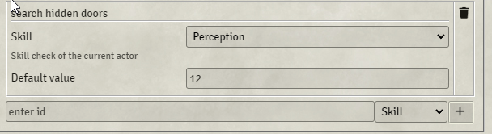

# Beaver's Gamepads

## Description
This Module lets you interact with activities in proximity range of your actor token.

In the first version I only have implemented one Activity: "Secret-Doors". 

It is originally designed for my local campaign where users do not have an own client but running around via gamepads.
With this I hope to bring some more automated interactions to the table.

## Included Activities
### Secret-Door Activity
This will allow users to search for secret doors and when they succeed make the secret door a normal door.

## Configure Activities
### global Settings
A gm can configure the global behaviour of an activity.
#### TestOptions
- skillCheck
  
- abilityCheck
  
  (not available for all system depends on bsa-implementation)
- gm prompt
  
  (will pop a question on gm client )
- userInput

  ask the user for some input e.g. password to open a door
- Success

## Notes
In order for this module to work a gm has to be connected.

## How to build your own Activities.
This module is intended to be extended, however the documentation about how to do it will come later.
The structure might change too much in the early versions to make it stable usable for others.

## Feature Plan
- Locked-Door-Activity
  - to open locked doors.
- Activity ui layer
  - A gm view to show existing activityResults
  - delete existing activityResults ( needed for interaction types )
- Basic GridActivities.
  - add to the ui layer the ability to drop Locations for GridActivities
  - delete Locations for GridActivities.
  - basic configuration of GridActivities.
  - global configuration of GridActivities.
- Find-Clue-Activity
  - an Activity to investigate a Location and returning some clues
- Loot-Activity
  - dropping loot on the canvas will transform it to a Location spot
  - or interact somehow with item-piles ?
- Basic TokenActivities.
  - asign activities to actors
  - detect tokens with activities on actor in proximity range.
- Extend Documentation.
  - how to build your own Activities.

